

     
    <h1 style="font-weight: bold">MovCon App API</h1>

  <a href="#description">Project Description</a> •
  <a href="#live-link">Live Link</a> •
  <a href="#setup">Project Setup</a> •
  <a href="#api-endpoints">API Endpoints</a> •
  <a href="#authors">Authors</a> •
  <a href="#license">License</a>

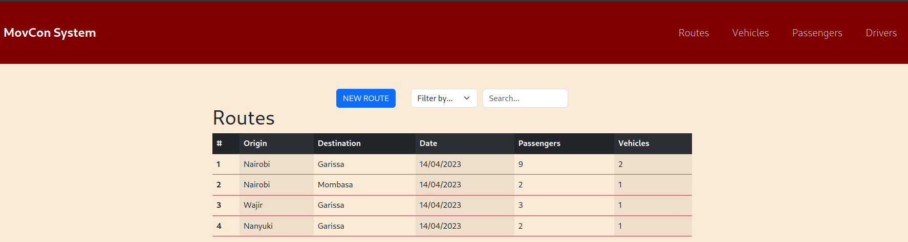

## Project Description
MovCon, short for **Movement Control**, is an app that is designed to track all the movement to and from various destinations, the vehicles, personnel and equipment involved in the particular movement.

## Live Link
The project  is hosted on [Render](render.com) and can be found here `https://movcon-app-api.onrender.com`

The front-end for this project  is hosted on [Render](render.com) and can be found here `https://movcon-app.onrender.com`

## Project Setup
To run the project locally,

> Clone this repo `git clone https://github.com/mashm3ll0w/phase-3-ip-backend.git`
>
> Move into the directory `cd phase-3-ip-backend`
>
> Install project dependencies `bundle install`
>
> Create the databases and add some seed data `bundle exec rake db:migrate && bundle exec rake db:seed`
>
> Start the server `bundle exec rake server`
>
> Navigate on your browser to `http://localhost:9292/`
>

Note:
1. This project depends on a frontend whose instructions for setting up can be found [here](https://github.com/mashm3ll0w/phase-3-ip-frontend)
2. Inorder to run this project locally, you will have to change the `fetch` urls in the project's component's to point to `http://localhost:9292`.

## API Endpoints

`GET /routes`

Returns an array of all the routes; including each route's vehicles, drivers and passengers.
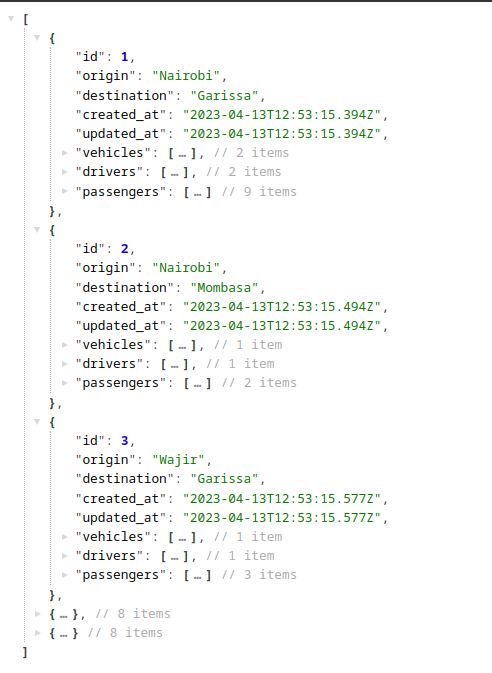

`GET /routes/:id`

Returns a single route with the a vehicle(s), the driver and passengers.
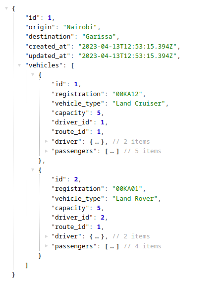

`POST /routes`

Creates a new route, driver, vehicle nd passengers.

Takes an object containing the `origin, destination, driver's name, vehicle_type, registration, capacity and a comma-separated list of passenger names`.

It return's the newly created route with the vehicle, driver and passengers
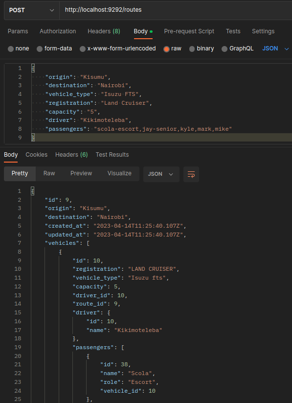

`DELETE /routes/:id`

Deletes a route with the given id, including the vehicles, drivers and passengers plying the route.

Returns a success message on completion.
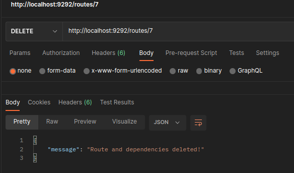

`GET /vehicles`

Returns all the vehicles, each showing it's driver and route

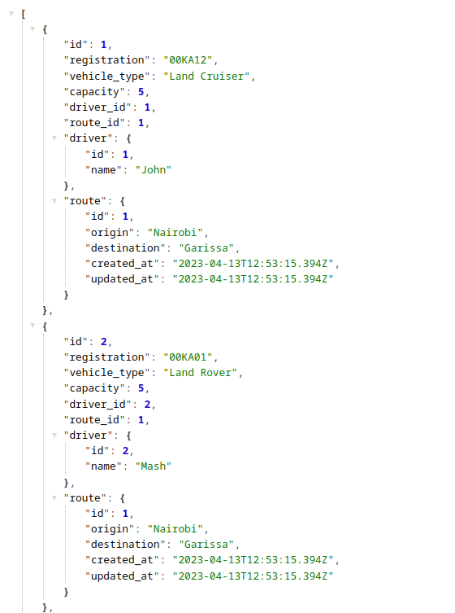

`GET /vehicles/:id`

Return the vehicle with the given `id`, also showing the route, driver and passengers.

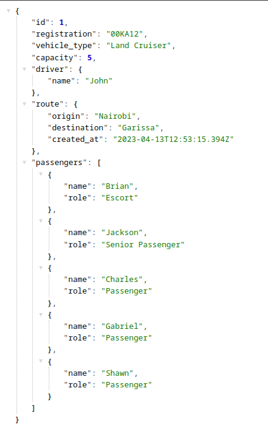

`GET /drivers`

Returns all the drivers, each showing their current vehicle and route

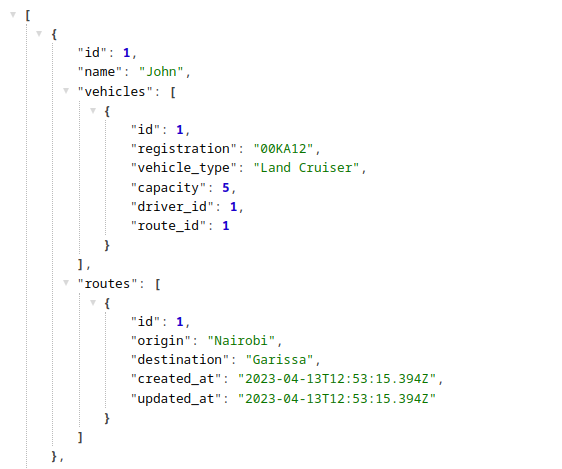

`GET /drivers/:id`

Return the driver with the given `id`, also showing the vehicle and route.

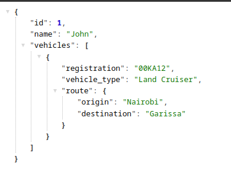

`GET /passengers`

Returns all the passengers, each showing their current vehicle and route

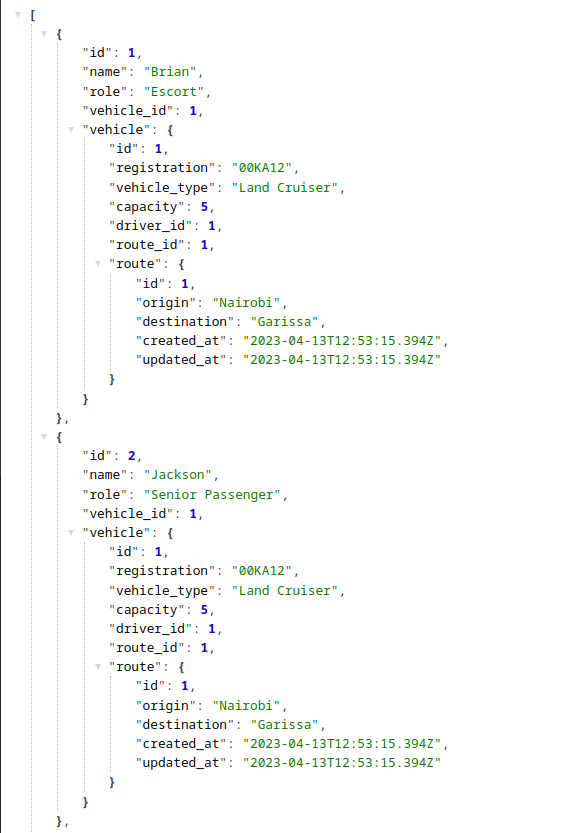

`GET /passengers/:id`

Return the passenger with the given `id`, also showing the role, vehicle and route.

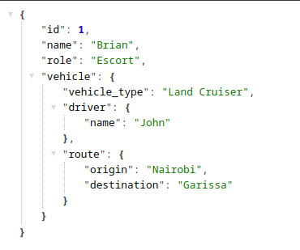

## Authors
[Charles Swaleh](https://github.com/mashm3ll0w)

## License

This software is licensed under the [MIT](https://github.com/mashm3ll0w/phase-3-ip-backend/blob/master/LICENSE.md) License
